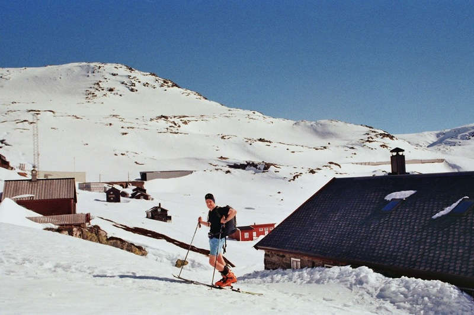
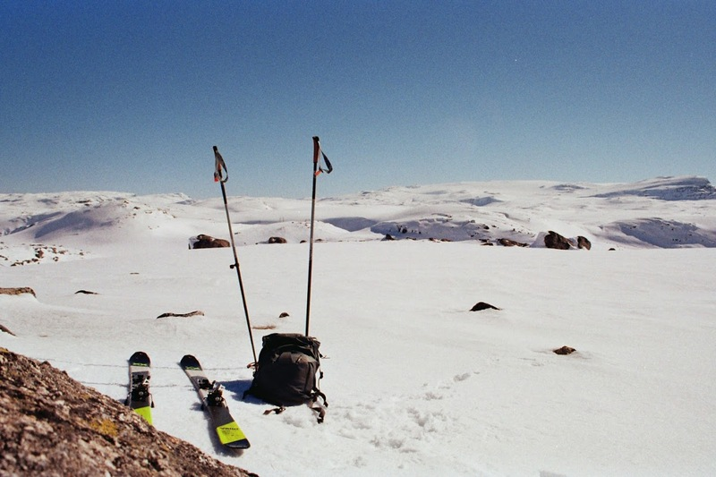

## An Englishmans guide to the (western) Norwegian outdoors

When I moved to Norway I had no idea what 'friluftsliv' or 'fjellski' were. Both, it transpires, are key components of the western Norwegian psyche. 

[I knew Norwegians like cross-country](https://www.youtube.com/watch?v=Wh0tzE6B8t0), I knew Norwegians were supposedly nuts about nature ([ahem](https://vimeo.com/216195764)), and I knew ski-touring was kind of a thing, maybe. However, I also felt rather lost and disoriented when I arrived in mid-winter, with colleagues talking about ski trips and cabin stays in remote mountains I couldn't place on a map. And, when I did look at the map it just looked like a maze of fjords and plateaus.

So, now that I know a thing or two (no expert, but done a few solo trips) I thought I'd share some things I picked up along the way[^1]. The emphasis is on winter activities with Bergen as a base, but this should also be useful for the spring transition season and some summer hiking, too. 

If you read through the whole thing you'll get a pretty good idea of what's going on (hopefully), or just skim to look for the headers relevant to you. This is intended as a broad overview so that you don't feel super lost. Youtube videos will be a better option for details such as getting your boots into bindings, and specific skiing techniques.

**First, what is friluftsliv**

Roughly translated, this is 'open-air life', or 'outdoor living'. This means [regular immersion in nature](https://www.nrk.no/video/spiller-fotball-i-uvaeret-i-hasvik_22e92586-da86-4094-9681-31d32200862a) for the sake of it (non-competitve, usually) and is something many Norwegians ~~been institutionalised into since birth~~ have grown up with. Honestly, it's nice -- the outdoors here are for everyone and people are serious about behaving responsibly out there.

**So where to start with skiing?**

Well, you have three options which, unfortunately, require three different types of skis and three different types of boots:

**Langrennsski (cross-country skiing)**: This is what most people think of when they think of skiing in Norway. You attach spindly lightweight skis to your feet, find a track, have a terrifying time going down hill and a workout going up. You will get absolutely left in the dust by a 16 year old practising their skating.

**Fjellski (mountain skiing)**: Fjellski has my heart. I had not heard of this before moving to Norway, but these are the more robust older sibling to langrennsskit, with steel edges so that you can (at least in theory) reduce your speed down a hill. These are built for fairly long distances going gently up and down away from the prepared tracks. If you were skiing to the South Pole, you would use these skis. 

<figure>
  
  <figcaption><em>January near Voss</em></figcaption>
</figure>

**Topptur (touring skis, randonee)**: You can use these in a resort, but mostly you attach skins to the bottom of them so that you can go up a mountain of your choosing before going back down it. These are high tech pieces of kit, with specialist bindings, skin attachments, and funky boots.

<figure>
  
  <figcaption><em>April in Hallingskeid</em></figcaption>
</figure>

There are also variations within each of these, but these are the main categories.

**Where to get skis**

Rent them at the resort. The most expensive option if you're doing this reguarly, and it limits you to resort areas, but it is usually hassle free.

Buy from a store. In Bergen this could be Intersport, Outdoor, or XXL. Outdoor is independent and has great service. XXL is a big big chain with few staff horrible lights but cheap prices. There is also Platou, though my one experience with these guys was negative (sorry!) -- very expensive and kind of condescending.

Get them from [finn.no](https://www.finn.no/recommerce/forsale/search?q=fjellski). This is craigslist for Norway and it's generally good deals with accurate descriptions and reasonable people. You could for example search '[fjellski](https://www.finn.no/recommerce/forsale/search?q=fjellski)' then set the location to Vestland, Bergen. Messaging in English is fine. This is where I got my very trusty pair of 90s made in Norway Fjellski and bamboo poles for ~600 NOK.

Borrow them from [Bua](https://www.bua.no/). This is an incredible service, with free rental of equipment for a period of a few days. They have a few centres in Bergen, so check the website for opening hours (usually a few days a week, for a few hours). To make an account with them you need a Norwegian phone number or someone who is willing to let you use theirs. I still do not have one, so I only used this once along with a friend, but this is maybe the way to go if you live here and just want to check it out.

Generally, langrenn are cheapest, followed by fjellski, and then topptur. 

**When is ski season?**

December to May. Well, the Voss resort usually opens in the first week of December and closes early April. The Myrkdalen resort a bit further up the valley might stay open a couple more weeks after that. I skied over Jostedalsbreen on the 17th of May weekend and I think they ran one more trip the week after, but skiing at much lower elevations would have been rather impractical. This year (2025) snow conditions were very bad, so things wrapped up earlier, but I still got a trip in at Finse towards the end of April. 

The Ski season in Bergen itself is more like a couple of weeks sometime in January-February. If you're lucky then, you may have the chance to ski the [løyper](https://www.bergen.kommune.no/innbyggerhjelpen/kultur-idrett-og-fritid/friluftsliv/turloyper/skiloyper-i-bergen-kommune) up Fløyen above Bergen on langrennsski, or the longer [Vidden route](https://aktiviteter.dnt.no/register/513236#/) on Fjellski.

**Falling over (a.k.a. starting out)**

Disclaimer, when I moved to Norway I could passable ski down a groomed track. This was a big help, but not a requirement. Mostly it helped feel a bit more comfortable on langrennsski and fjellski, but I definitely had my fare share of tumbles getting started on these (and still fall over reguarly).

You could book lessons, but I think for langrenn and fjell, it's also just as well to go for the natural approach of starting very easy and gradually doing harder things until before you know it you're on your way. For example, if you've never skied before, going 200 m on langrenn is going to feel like a big deal, well done ! You will fall over a lot so, make sure you're wearing clothing that covers all exposed skin and remember that it's usually better to fall sooner rather than later, when your speed is even higher. A good fall should take some of the force and not leave you in an awkward position, but there is definitely no elegant way of doing this. Much better to fall sideways in a skid, than end up going over the nose of your skis. 

When you are down, you will feel very immobile. To get back up, try to get both skis under your centre of gravity, and use your poles to get yourself squatted, then standing. If you use your hands these will just go into the snow when you put weight on them. Make sure you're also aligned across slope, or you will just immediately fall over again!

**Dangers**

Before we get into the actual skiing it's important to say: skiing can be dangerous, and people dye doing this every year. The only real risk from skiing very close to a cabin on the flat is torn ligaments, twisted joints etc. but things can quickly escalate. I'm not a safety professional, but here are some key things to be wary of:

**Frozen lakes**: The feeling of skiing over a frozen lake is incredible, and often these are very safe. A good couple of weeks at minus 10 is going to make most water safe. There will still be some water flow under there however, so be aware of patches that could have more running water and hence thinner ice. Also watch out in spring when things get a bit slushy. Actually, a little bit of surface melt is not necesarily something to worry about if it's the first thaw of the year -- if the ice is still deep underneath that extra weight is not going to cause it to break up -- but this is a sign for concern if it's later into spring. 

Following people is not necessarily a good idea. Trust your own instincts if you're unsure. I remember venturing out onto a frozen lake on Vidden following some Norwegians and having slush come up to my ankles while I could feel the plates underneath move. Not fun or recomended, but okay in the end!

**Avalanches**: Absolutely not to be taken lightly. But these can be largely avoided by **sticking to low-angled slopes away from runoff zones**. [ut.no/kart](https://ut.no/kart#8.95/60.749/6.2438) is a great resource for this. Go to layers and turn on bratthets- og utløpsområdekart. Don't go in anything marked green, yellow, orange, red, or blue, and you're going to be fairly safe, with a lot of super fun mountains still to explore. Slopes below 27° are much less likely to have sustained avalanche activity (non-coloured), while the blue areas mark where large avalanches could potentially run over in to. *I think* that the ut.no kart is fairly conservative, that is, I've never felt sketchy in an area marked safe on ut.no/kart. But, as with everything here, I am not an expert, and this is not a garauntee. 

Personally, I stick almost exclusively to safe slopes. I am simply not a good enough skiier that I have a burning desire to venture into steeper slopes, and knowing I'm in potentially avalance terrain gives me the heebie jeebies. If you are going into avalanche terrain, **you will need avalanche gear** and you should probably **take an avalance course** for the safety of yourself and those who might need rescuing. This post is not an avalanche safety post. The best I can do is direct you to something like [this](https://www.rei.com/learn/expert-advice/avalanche-safety-gear.html) if you want to find out more.

**General bodily harm**: Falling over in awkward ways can lead to injury, of course, and generally scales with the speed at which your body hits something, mitigated somewhat by the softness of the snow. Watch out, and be careful. Helmets are very much recomended for topptur. If you're going fast and [tomahawk](https://www.youtube.com/watch?v=jWrNtGl7VYs), having something on your noggin will be a help. People doing langrennsski and fjellski generally don't wear helmets (I don't, either), but I have a friend who got a bad concussion from a fjellski fall. If you're worried about this, wear a helmet and to helvete what people think about it.

**Exposure**: Norway is cold, frequently! It may also be very windy and dark. At a minimum, if you're venturing out into the mountains proper you should have a decent pair of gloves and a backup, a roll mat, a sleeping bag, a serious hat or balaclava, goggles, plenty of layers, and a shovel. If the worst comes to it you can then at least make a snow wall or a cave and stay warm. If it's a bluebird day in April and you're not going far is this necessary? No, you can take a more limited set. But, if you're going some distance and the weather is even slightly uncertaint then it's a good idea. DNT trips will mandate this equipment. 

You may also want to get a [vindsekk](https://www.dntbutikken.no/helsport/654373/vindsekk-til-2-helsport-bivy-bag-storm-shelter) (or wind sack). These are rather expensive, and I don't have one for this reason, but they might save you in a pinch, or offer somewhere more comfortable to eat your brunost sandwiches. This type of thing can also be rented from BUA. Of course if you're camping anwyway, then you don't need a vindsekk. I only have limited experience camping in winter, and I'm not going to go into details here, but get in touch if you'd find that useful.

**Getting lost**: I was on a DNT trip where it was -18, dark, windy and snowy. The guide took out their mobile phone and the ut.no *website* to get us to the cabin. I did not ask, but sincerly hope there was a back up option. If money were no object this would be a satnav with built in [inReach](https://www.garmin.com/en-US/c/outdoor-recreation/satellite-communicators/). When I went on my solo trip I borrowed one of these with a friend, and felt a lot better for it.

**Getting started with Langrennsski**

It's very common for Norwegians to have a pair of langrennsski knocking about, so there are a lot of cross country tracks around Bergen that won't have hire -- the assumption is you will just have your own already. 

If you're looking for a resort, [Voss](https://www.vossresort.no/skisenter/langrenn) is the sensible option. It's a little over an hour away from Bergen by train and has a gondola right from the station to the top of the mountain. From there you can hire out skis and be on your way on some nice well-maintained tracks in no time. 

Otherwise, you can go to [Geilo](https://www.geilo.com/en/vestlia-resort), also by train, but that's quite a long way away from Bergen and I prefer the western Norwegian mountains. 

Locally and without hire, there are the routes up Fløyen when the conditions are in. This can be really nice, there are good vibes going up the furnicular when everyone in it is looking forwards to a good ski. And, unlike in Oslo (or so I've heard), people are generally very nice and accomodating if you're slow or falling over a lot. 

Further afield there are routes at [Gullbotn](https://bof.no/lysloypen-og-varmestuen-pa-gullbotn/) about 40 mins away, or [Kvamskogen](https://kvamskogen.no/wp-content/uploads/2018/02/L%C3%B8ypekart_kvamslkogen.pdf) a bit over an hour away, but both require a car. 

You shouldn't really venture off prepared tracks with langrenn, though it is possible. Many introductory langrennsski have fish scale bases. These will provide some grip going uphill, which is good. Otherwise you enter the exiting world of waxes (see Waxes and skins header). 

The boots on langrennsski are very lightweight and can feel flimsy. They will also let a lot of snow in if you do venture off the tracks into powder. Personally, I am less of a fan of langrenn for these reasons -- it can all feel a bit artifical and contrived, but it's the way to go if you want to be the next Klæbo ([Klæbo brostep supercut](https://www.youtube.com/watch?v=_Qo2QTgXs70)). Which brings us to...

**Getting started with fjellski**:

Your best option here is going with someone who knows what they're doing, which may sound like a bit of a catch 22. However, you can also take the same approach as for Langrenn, and just gradually increase the distance and difficulty alone. Just watch out, fjellski becon the mountains proper, and once you're off the marked tracks more dangers await.

Personally, I used my fjellski on langrenn tracks for a couple of trips before progressing off the tracks while teaching on a field course (so there were plenty of others around). If you're taking this approach, note that langrenn trakcs are too narrow for broad fjellski so you may want to take this into account when you buy your fjellski, though there will always be a flat section next to the tracks for gliding, and it's no real penalty to use these instead if your skis are too broad. Using broad skis on narrow tracks is a no no, it damages them for other users!

Once you feel comfortable, I'd recommend following a gentle 'twig' route. These are routes set up by **DNT** (Den Norske Turistforening) or other volunteer organisations in late winter early spring. Sometimes these are groomed, but often they are not. These are a good bet, they tend to follow safe routes, and as long as you have 6 m visibility you are not going to get lost. That said, you should still be careful (see Dangers). You could for example, start with some (maybe even all) of this [fairly flat route](https://ut.no/kart/rutebeskrivelse/136774/fra-finsehytta-til-hallingskeid-via-laghellerskaret) from Hallingskeid to Finse. With Hallingskeid also having a [nice DNT cabin](https://ut.no/kart/hytte/10805/hallingskeid-turisthytte#11.4/60.6461/7.3139) right by the station.

When you have your fjellski legs, you may want to embark on your first DNT trip. You can find these listed [here](https://www.dnt.no/sok/?tab=activities&county=Vestland&tripcategory=ski+touring). They will say when they open for booking, and it's better to be early to avoid dissapointment. Most if not all people on these trips will be speaking Norwegian. This is a great way to meet Norwegians from different walks of life, but it is a good idea to have some Norwegian basics. Even if you can't communicate properly they will appreciate that you're trying. Doing two multi-day DNT fjellski trips really took me from ok-ish to passable, but it's definitely a good idea to start out on the easier end. 

As DNT trips are often a bit adventurous, you could also try to find an experienced friend to go on a shorter trip such as [this](https://ut.no/kart/rutebeskrivelse/13394406/fra-smabrekke-til-gullhorgabu#12.58/60.51431/5.98709) which is 'only' 6 km and 300 m height gain. 

From there, more possibilities open up. After this I did my first solo trip (to [Grindaflethytta](https://ut.no/kart/hytte/10363/grindaflethytta#8.95/60.749/6.2438)) and felt confident enough to sign up for a trip over Jostedalsbreen, though that was still a big struggle and learning experience[^2].

As for equipment, aside from the skis you will need boots, poles, and other safety equipment (see Dangers). I first bought some very retro Alfa boots from finn, before progressing to a fancy pair of goretex Alfas with [built-in gaiters](https://www.alfa.no/en-NO/outback-aps-w-2). The built-in gaiters do work great, but you can get away with ones that look more like regular hiking boots and then add gaiters if needed, and these will be nice if you're skiing in spring when there is no powder and its warm. 

I started off with bamboo poles, which were great! When one finally snapped when I fell on it I got a pair of Swix aluminium ones that were on offer at XXL. These are longer than normal downhill poles, but I use them for that too anyway, because I'm cheap. 

**Getting started with topptur**

So, you have decided to take things up a notch. For me this took two years of living in Norway before I made the leap, but it was well worth it. With Topptur, the skill, planning, and danger can all creep up, and you definitely want to be profficient on piste before making the change. That said, the experience of standing on top of a peak in bluebird conditions, with a clean 500 m of vertical descent to take you back down is incredible.

<figure>
  
  <figcaption><em>Ahh yeah</em></figcaption>
</figure>

With topptur, you are more likely to be in avalance terrain though it's surprisingly easy to avoid it with the difficult then being finding people to join who are happier on more mellow slopes. If so, try to go with people who are more experienced than you, or join a DNT trip -- as with the fjellski DNT trips though, make sure you're good enough first that you wont be a drag on everyone else. You don't need to be an elite athlete, but you should probably have tried to skin up and go down a handful of times. 

My first topptur was just going 150 m above the lift at a resort and for me that was already great. Then I did a couple more trips with friends, and got the hang of it without too much trouble, helped along by experience in fjellski. If you can go downhill without crashing every 2 minutes on fjellski, it's likely topptur will be a breeze. 

Unlike fjellski, topptur is suited to having minimal switches between up and down. It's a lot more faff to take skins off and on again, and long flat strectches are a bit awkward. Norwegians also frequently don't go all the way to the very top? They'll get within a hundred metres of the top, but it won't be good for skiing, or will have a short downhill section first, and they'll just turn around. For me this is not the way to go, I like thinking of topptur as turbocharged hiking and getting a top is always nice, but it's something to be aware of. 

As for equipment, you will need expensive skis and boots. I got my boots through some previous field work (hurray) but the skis were around 4,500 NOK including skins and bindings from finn. These serve me great, but you would be looking at upwards of 10,000 NOK to get new skis alone. A guide [like this](https://www.sport-conrad.com/blog/en/ski-touring-guide-find-the-best-skis-for-your-next-ski-tour/) will give you a good introduction. 

**Waxes and skins**

**Kick turns**

**Useful websites**

**Other useful services**

Dele

[^1] : A lot from Philipp, my office mate who is outdoorsy even by Norwegian standards.
[^2] : Thank you so much to the Danish guy on that trip who was just a bit slower than me, allowing me to at least feel like I wasn't holding everyone up.