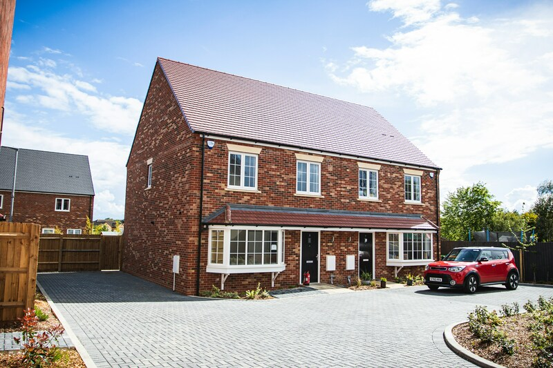

## Newbuilds in Norway, sadly better in almost every way

Newbuilds in the UK have an unfortunately reasonable reputation as small, poorly built, and a bit desolate. Drive along the dual-carriageway bypass of a small town in the UK and you're likely to see a thin `sound-proofing' fence between you and an assortment of cookie-cutter red brick houses, more or less plonked in a field with no embedded sense of being a lived in area. I'm allowed to say that, I grew up in a 1960s Wimpey home, though they did at least include bigger gardens back then. 

Spend some time in Norway though, and the vernacular of newly built housing projects is totally totally different. Gone are the small 'my home is my castle' fences, gardens, and driveways, the poor transport links. In are (generally) well-built, well designed blocks of low-rise flats with balconies that actually look, you know, altogether appealing places to live. 

These aren't uniformly perfect, there is a lot of older housing-association building in major cities that greatly reduces housing availability pressure but isn't exactly joyful and some housing projects are sub par, but by and large it's a world away from the system we plod along with in the UK. This post explores why that is. Keir dear, if you're reading, let this be my case to you as to why we should go more in on low rise apartments, unions, and architects xoxo. 

### **What's up with the UK**

<figure>
  
  <figcaption><em>Fig. 1. Not much red on their brick now is there. Photo by <a href="https://unsplash.com/@photofeaver?utm_content=creditCopyText&utm_medium=referral&utm_source=unsplash">James Feaver</a> on <a href="https://unsplash.com/photos/brown-brick-house-under-blue-sky-during-daytime-9bpBZ2iHe6o?utm_content=creditCopyText&utm_medium=referral&utm_source=unsplash">Unsplash</a></em></figcaption>
</figure>

We are consistently informed of housing targets, whether these have been met, and whose fault it is if they haven't been. It's also clear that we do need new housing, lots of it. A lack of housing is a drag on peoples quality of life, their security, and the economy (if you want to make the argument that not building houses is good because it slows down growth and therefore helps the planet please leave, that's a stupid argument and you should know better). Low housing availability directly plays into the hands of landlords and lets them get away with high rents for poor quality[^1]. 

The thing is though, we never really get beyond the B\*rratt, T\*ylor W\*mpey, P\*rsimmon hegemonic ideal of Fig. 1. C'mon, take your snagged-out box of ticky-tacky in an old wheat field and then shut up. Exceptions exist

[^1]: Great Britain?: How We Get Our Future Back by Torsten Bell has some very well researched coverage on this.
      

