## some photos I took 

&nbsp;

<figure>
  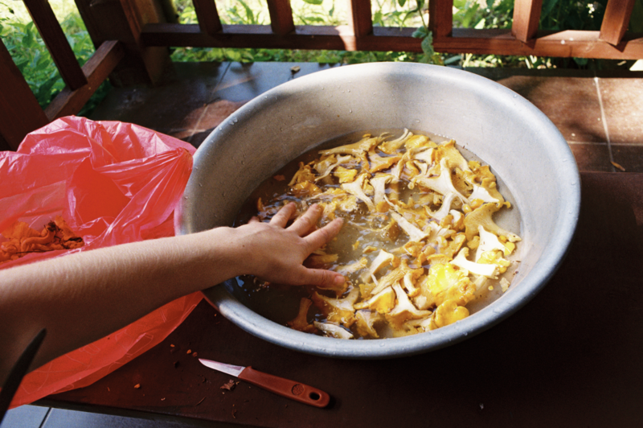
  <figcaption><em>Kantarell</em></figcaption>
</figure>

&nbsp;

<figure>
  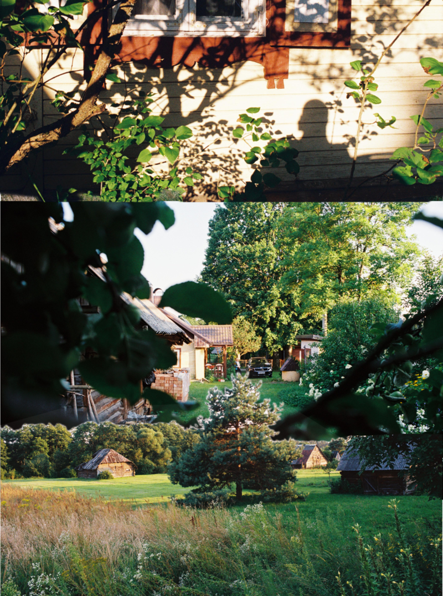
  <figcaption><em>Biekštos</em></figcaption>
</figure>

&nbsp;

<figure>
  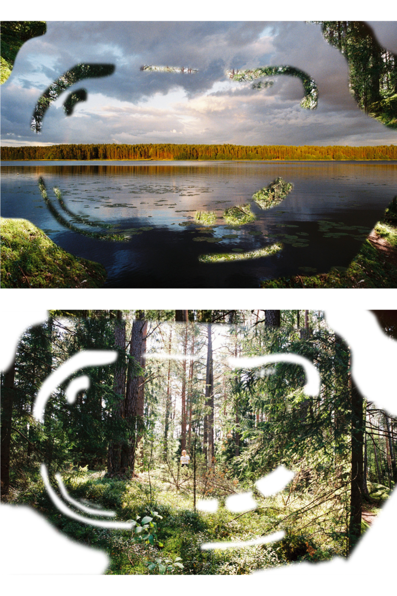
  <figcaption><em>⋆ ̊꩜。</em></figcaption>
</figure>

&nbsp;

<figure>
  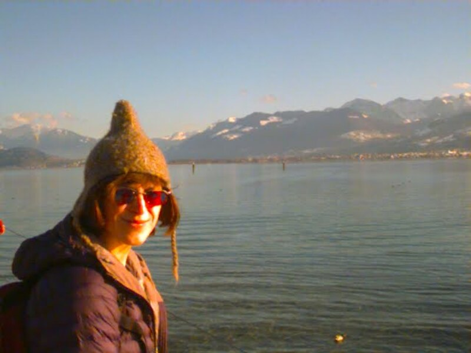
  <figcaption><em>CLAIRE by Zürichsee on the Apple QuickTake 150</em></figcaption>
</figure>

&nbsp;

<figure>
  

    <iframe
      src="https://www.youtube.com/embed/PZRLB5Ym_Z4"
      title="0718"
      allow="accelerometer; autoplay; clipboard-write; encrypted-media; gyroscope; picture-in-picture"
      allowfullscreen>
    </iframe>
  

  <figcaption><em>Gornergletscher</em></figcaption>
</figure>

&nbsp;

<figure>
  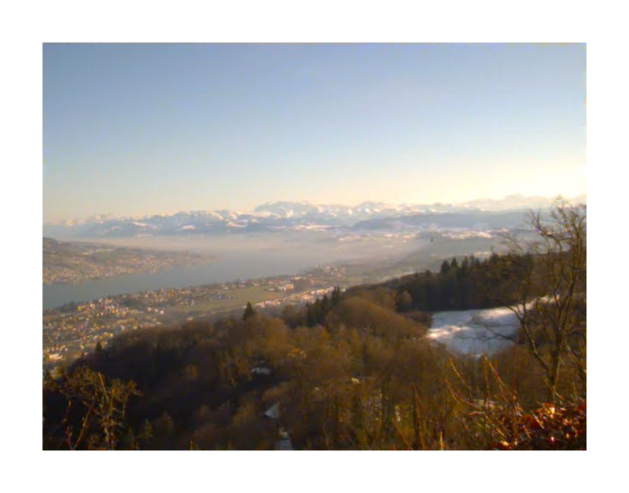
  <figcaption><em>Zürichsee and Glarner Alpen on the Apple QuickTake 150</em></figcaption>
</figure>

&nbsp;

<figure>
  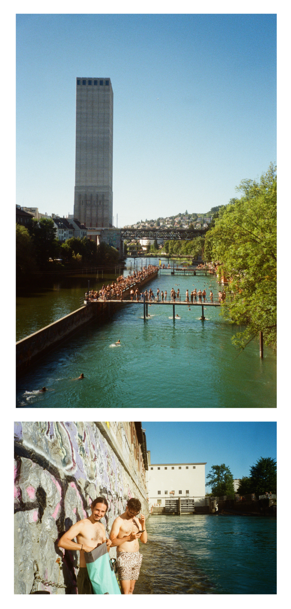
  <figcaption><em>There's Earth's tallest operational grain elevator, so there's that</em></figcaption>
</figure>

&nbsp;

<figure>
  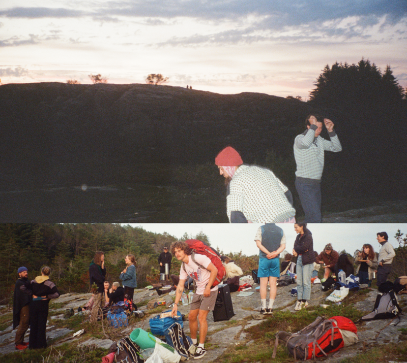
  <figcaption><em>' '</em></figcaption>
</figure>

&nbsp;

<figure>
  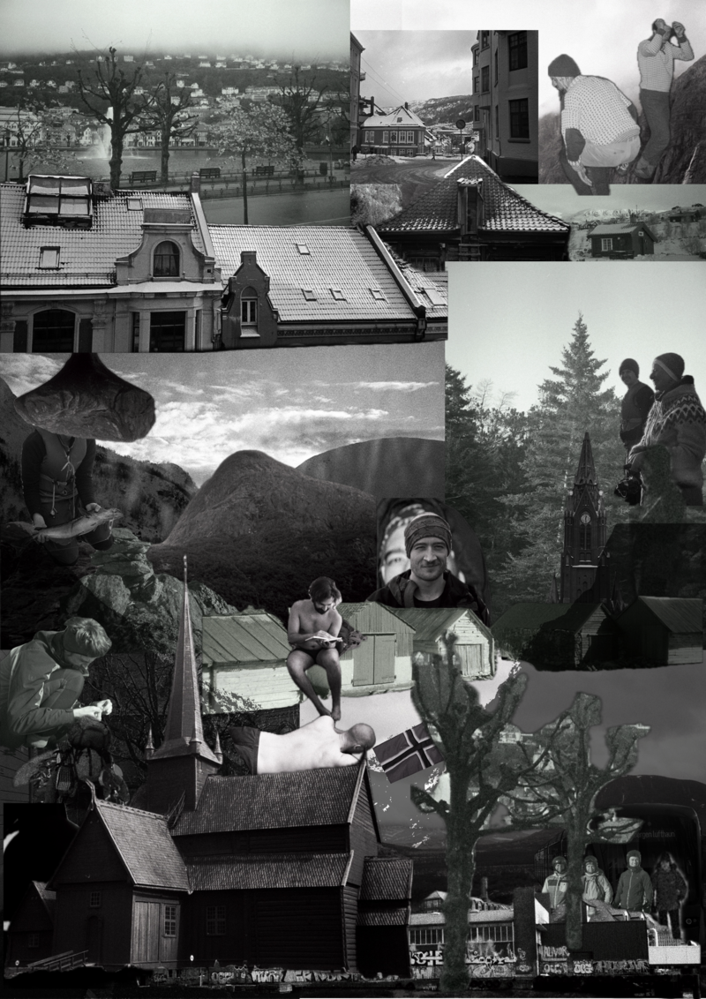
  <figcaption><em>' '</em></figcaption>
</figure>

&nbsp;

<figure>
  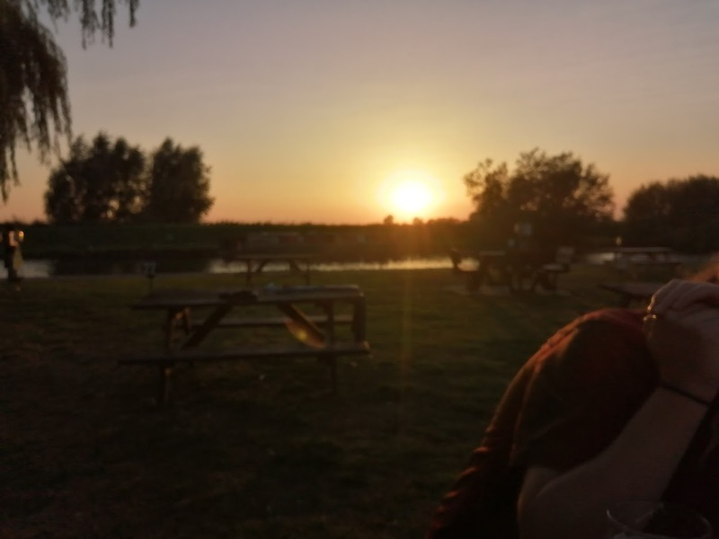
  <figcaption><em>Five miles from anywhere</em></figcaption>
</figure>

&nbsp;

<figure>
  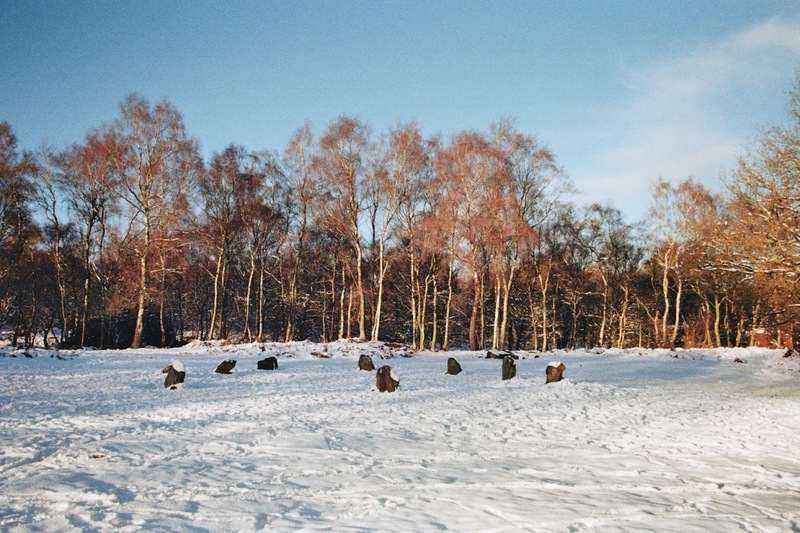
  <figcaption><em>moor stones</em></figcaption>
</figure>

&nbsp;

<figure>
  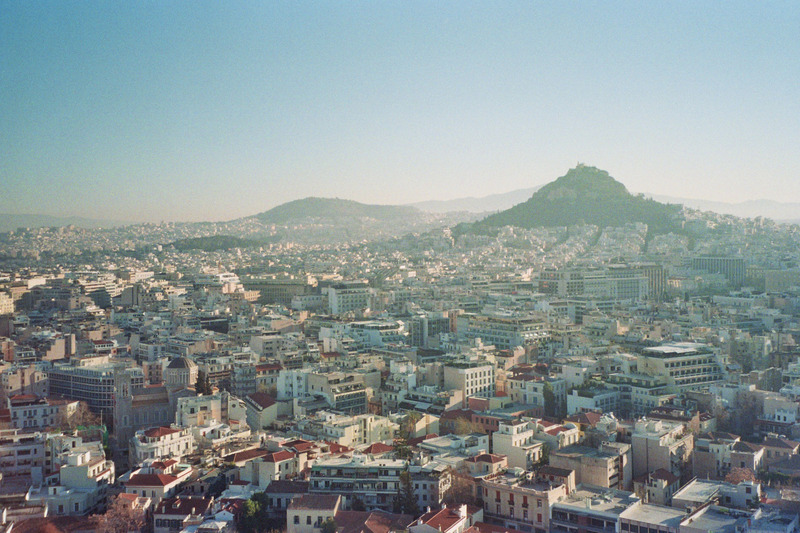
  <figcaption><em>Athens</em></figcaption>
</figure>

&nbsp;

<figure>
  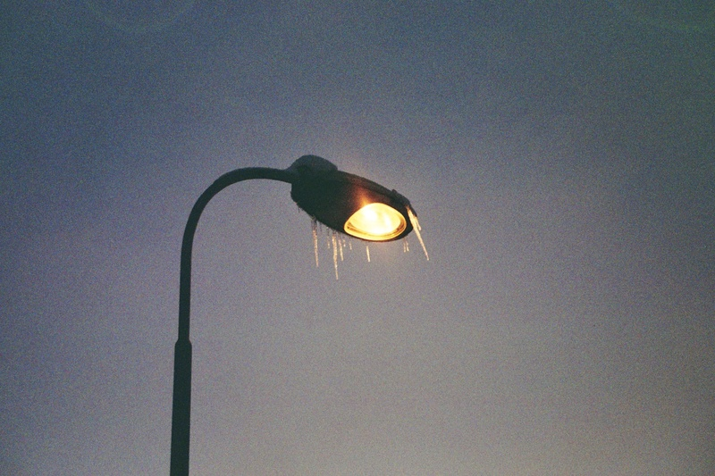
  <figcaption><em>the street lamp outside my old apartment (in winter, obviously)</em></figcaption>
</figure>

&nbsp;

<figure>
  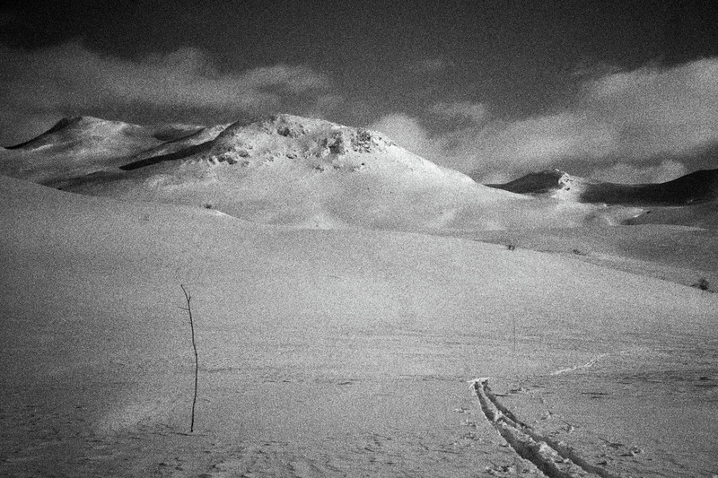
  <figcaption><em>follow the frozen sticks</em></figcaption>
</figure>

&nbsp;

<figure>
  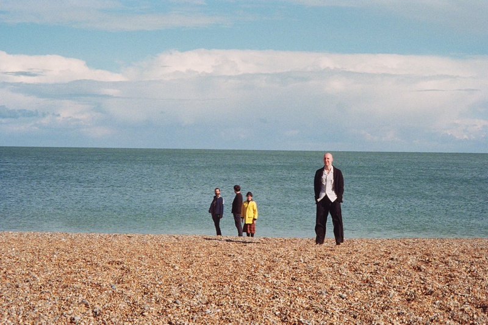
  <figcaption><em>west is mike and suzy (east is the north sea)</em></figcaption>
</figure>

&nbsp;

<figure>
  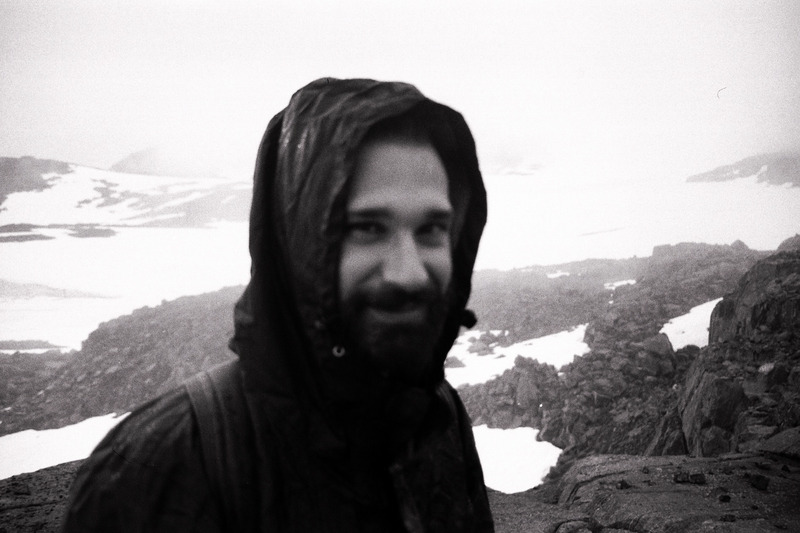
  <figcaption><em>Carlos</em></figcaption>
</figure>

&nbsp;

<figure>
  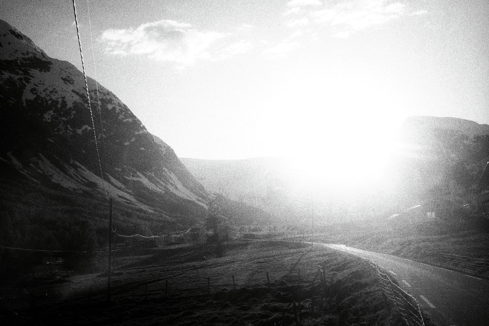
  <figcaption><em>The Sun</em></figcaption>
</figure>

&nbsp;

<figure>
  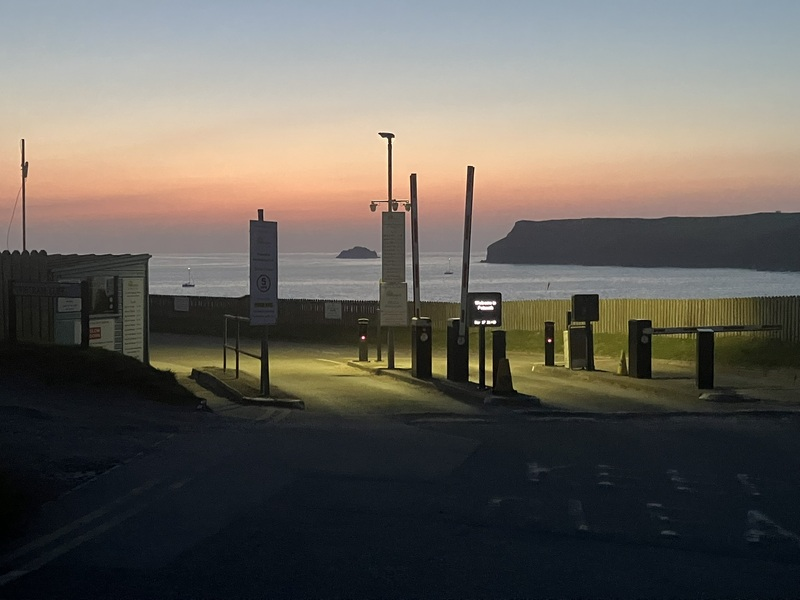
  <figcaption><em>Keep clear </em></figcaption>
</figure>

&nbsp;

<figure>
  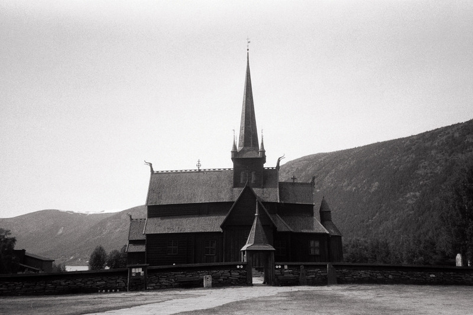
  <figcaption><em>Dragons' heads </em></figcaption>
</figure>

&nbsp;

<figure>
  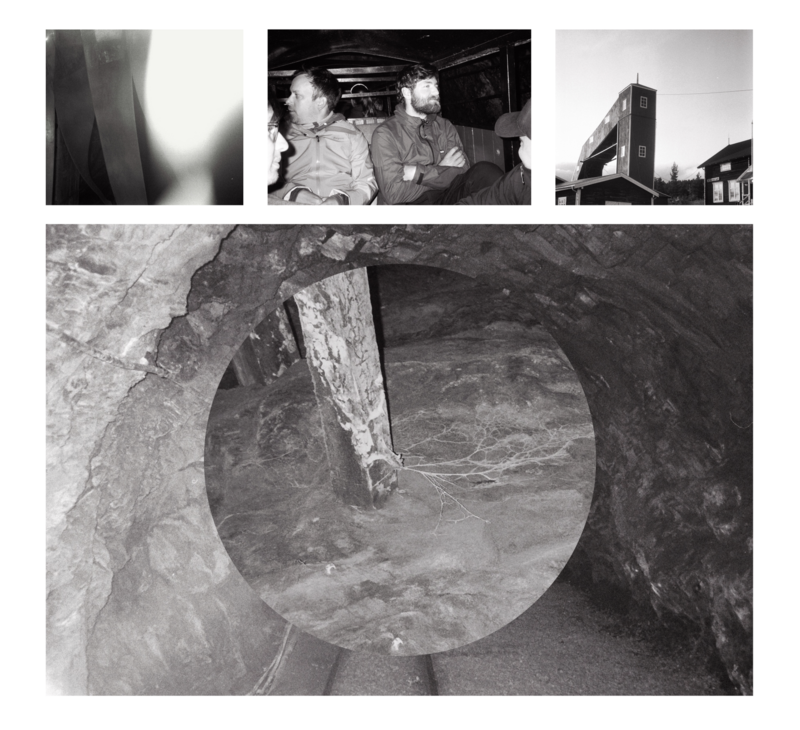
  <figcaption><em>There were thick strands of mycelium growing out of pit props in Folldal mines </em></figcaption>
</figure>

&nbsp;

<figure>
  
  <figcaption><em>  </em></figcaption>
</figure>

&nbsp;
&nbsp;

<figure>
  
  <figcaption><em>To the lighthouse </em></figcaption>
</figure>

&nbsp;

<figure>
  
  <figcaption><em>Church by the sea </em></figcaption>
</figure>

&nbsp;

<figure>
  
  <figcaption><em>Around summer solstice, around midnight, around Vidden </em></figcaption>
</figure>

&nbsp;

<figure>
  
  <figcaption><em>Thermals</em></figcaption>
</figure>

&nbsp;

<figure>
  
  <figcaption><em>Fonnabu</em></figcaption>
</figure>

&nbsp;

<figure>
  
  <figcaption><em>Wire</em></figcaption>
</figure>

&nbsp;

<figure>
  
  <figcaption><em>Torso in metal </em></figcaption>
</figure>

&nbsp;

<figure>
  
  <figcaption><em>Hardangervidda</em></figcaption>
</figure>

&nbsp;

<figure>
  
  <figcaption><em>Utrecht on a misty morning</em></figcaption>
</figure>

&nbsp;

<figure>
  
  <figcaption><em>Don't crash into the bridge</em></figcaption>
</figure>

&nbsp;

<figure>
  
  <figcaption><em>Eidsvåg E39</em></figcaption>
</figure>

&nbsp;

<figure>
  
  <figcaption><em>Somewhere near Voss in January</em></figcaption>
</figure>

&nbsp;

<figure>
  
  <figcaption><em>_</em></figcaption>
</figure>

&nbsp;

<figure>
  
  <figcaption><em>Electricity or something</em></figcaption>
</figure>

&nbsp;

<figure>
  
  <figcaption><em>Junction</em></figcaption>
</figure>

&nbsp;

<figure>
  
  <figcaption><em>The boats never get used, I think they're decoration</em></figcaption>
</figure>

&nbsp;

<figure>
  
  <figcaption><em>Fløyen</em></figcaption>
</figure>

&nbsp;

<figure>
  
  <figcaption><em>Dette her</em></figcaption>
</figure>

[back](./), [2](./photos_html.html)
